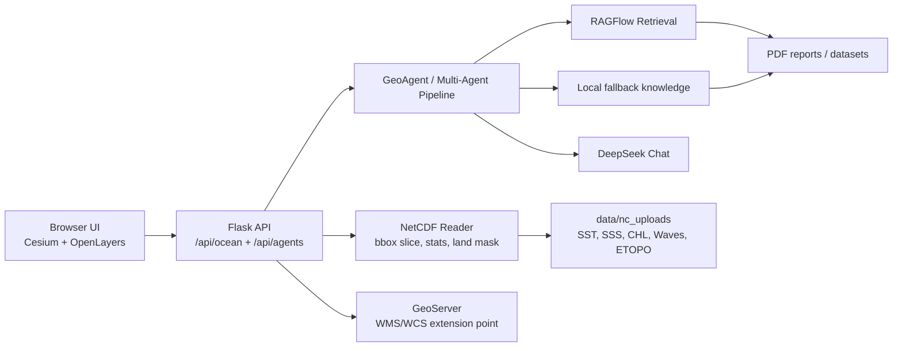

# Ocean Digital Earth RAG Multi-Agent Demo

面向项目展示和求职答辩的海洋数字地球系统。项目把 Cesium 三维地球、OpenLayers 二维定位、NetCDF 海洋要素切片、RAGFlow/本地知识库检索、DeepSeek 多 Agent 报告生成整合到同一条可演示链路中。

## 当前定位

本项目不是单纯聊天机器人，而是一个“空间数据 + 知识检索 + 多 Agent 推理”的海洋风险分析原型：

- 用户在地球上框选区域。
- 后端按经纬度读取 NetCDF，返回格点、统计值和渲染元数据。
- 前端按变量类型选择合适渲染方式。
- AI 助手把区域数值、RAGFlow 检索证据和多 Agent 推理过程合成报告。

## 核心能力

- 数字地球：Cesium 三维地球、框选区域、海洋栅格图层叠加。
- 二维定位：OpenLayers 小地图同步框选和渲染结果。
- NetCDF 读取：Flask 后端读取 `.nc`，按 bbox 切片，支持 `step` 和 `max_points` 降采样。
- 渲染分类：按变量类型限制渲染方式，避免用标量数据伪造粒子流。
- 陆地掩膜：使用 ETOPO 2022 高分辨率地形/水深数据做 land mask，海洋变量落到陆地区域时返回 `null`，前端不渲染。
- RAG 检索：RAGFlow 优先，本地知识库回退，保证 demo 在离线或 RAGFlow 未配置时仍能运行。
- 多模态检索：可选上传海洋科研图，由独立 Chinese-CLIP + Faiss 服务召回文本证据，并与文字 RAG 融合。
- 多 Agent 报告：Intent、Retrieval、Context、Screening、Reasoning、Report、Critic 组成可追踪报告流水线。
- 证据链展示：前端显示 Agent trace、保留/过滤证据、来源文档、页码、知识库来源和 Critic 结果。
- 工程化部署：Nginx、Flask/Gunicorn、GeoServer、SQLite、Docker Compose。
- 离线评测：`eval/` 提供固定问题集、报告和指标脚本。

## 系统架构



## 渲染规则

前端不再把所有变量都暴露给所有渲染模式，而是由后端元数据控制：

| 变量类型 | 示例 | 可用渲染 | 说明 |
| --- | --- | --- | --- |
| 标量 `scalar` | SST、SST anomaly、盐度、叶绿素、浪高 | 填色、等值线、点图 | 普通海洋要素，不开放粒子流 |
| 地形/水深 `relief` | ETOPO elevation/bathymetry | 填色、等值线、点图 | 正高程陆地被置空，不渲染颜色 |
| 矢量分量 `vector_component` | `u/v`、`uo/vo`、`u10/v10` | 当前暂不开放粒子 | 已预留识别规则，等待后端联合查询 |
| 真实矢量场 `vector` | 后续海流或风场合成变量 | 填色、粒子流 | 只有真实 `u/v` 场才做 Windy 风格粒子 |

关键原则：

- SST、盐度、叶绿素、浪高等标量只做填色、等值线、点图。
- 粒子流必须由真实矢量场驱动，不能用标量梯度伪造。
- 海洋变量查询会用 ETOPO 掩膜清理陆地区域。
- 粗分辨率数据的格子如果覆盖陆地，会整格置空，优先保证陆地不被涂色。

## 访问地址

- Demo Web: http://127.0.0.1:8000
- Demo Health: http://127.0.0.1:8000/api/health
- Project Status: http://127.0.0.1:8000/api/project/status
- Ocean Datasets: http://127.0.0.1:8000/api/ocean/datasets
- RAG Status: http://127.0.0.1:8000/api/rag/status
- GeoServer: http://127.0.0.1:8000/geoserver/web/
- RAGFlow Web: http://127.0.0.1:8088
- RAGFlow API: http://127.0.0.1:9380

## 快速启动

```powershell
cd C:\Users\lmh\Desktop\海洋rag+多agent

# 中文路径下 Docker Desktop build session 可能触发 gRPC header 编码问题。
# 建议长期使用英文路径 clone；临时运行时可先关闭 BuildKit。
$env:DOCKER_BUILDKIT='0'
$env:COMPOSE_DOCKER_CLI_BUILD='1'

docker compose up -d --build
```

首次启用图片检索前，需要导出证据并构建 Faiss 索引：

```powershell
python scripts\export_multimodal_evidence.py --parse-pdf --output data\multimodal_index\evidence-source.jsonl
docker compose --profile indexing run --rm multimodal-index-builder
```

一次性建库任务以可写方式挂载 `data/multimodal_index`，在线服务保持只读挂载。模型权重首次使用时下载到 `multimodal-model-cache`。未构建索引或服务不可用时，带文字的问题会自动降级到原有文本 RAG。

仓库内另有一组小规模权威验证集 `data/curated_multimodal`，包含 3 张 NASA/NOAA/IPCC 官方图像和 7 条与 SST 异常、ENSO、海洋热浪及空间显著性检验直接相关的证据。它会随 `load_docs()` 自动进入文字知识库和 Chinese-CLIP 索引。该集合用于验证“图片能否召回正确证据”，不是通用训练集，也不应被扩充为大量低质量图片。

图片查询模式的能力边界：当前图片只经过 Chinese-CLIP 编码并检索文字证据，未执行 OCR、图像描述、色标读取或像素级数值解析。报告会把“召回到的证据”和“从原图直接识别到的信息”明确区分；确定解释仍需用户提供图题、图注、变量、单位、时间、异常基准期和显著性检验方法。

启动 RAGFlow：

```powershell
cd C:\Users\lmh\Desktop\海洋rag+多agent\ragflow_stack
docker compose up -d
```

诊断：

```powershell
cd C:\Users\lmh\Desktop\海洋rag+多agent
powershell -ExecutionPolicy Bypass -File scripts\diagnose.ps1

# 跳过 Docker/RAGFlow 深度检查，适合快速确认 API 和 Agent 链路
powershell -ExecutionPolicy Bypass -File scripts\diagnose.ps1 -SkipDocker -SkipRagFlow
```

## 环境变量

复制 `.env.example` 为 `.env`，填入自己的配置：

```text
DEEPSEEK_API_KEY=...
DEEPSEEK_MODEL=deepseek-chat
DEEPSEEK_BASE_URL=https://api.deepseek.com

RAGFLOW_BASE_URL=http://host.docker.internal:9380
RAGFLOW_API_KEY=...
RAGFLOW_DATASET_IDS=dataset_id_1,dataset_id_2

OCEAN_EMBEDDING_BACKEND=hash
OCEAN_EMBEDDING_MODEL=local-hash-ngram-v1
OCEAN_EMBEDDING_WEIGHT=0.42
```

说明：

- DeepSeek 用于 Intent、Screening、Report、Critic。
- RAGFlow 未配置时，系统自动回退到 `data/ocean_knowledge.json`、`data/knowledge_docs/`、`data/pdf_reports/` 的本地检索。
- 本地检索默认启用离线 hash/ngram embedding，与关键词分数做 hybrid fusion；`OCEAN_EMBEDDING_BACKEND=keyword` 可关闭向量分数，`sentence_transformers` 可在安装可选依赖和模型权重后启用真实多语种 embedding。
- `.env` 已加入 `.gitignore`，不要提交真实 Key。

## 数据目录

```text
data/
  nc_uploads/        # 用户下载的 NetCDF 文件
  pdf_reports/       # PDF 报告，默认不入库
  knowledge_docs/    # 本地摘要种子文档
  ocean_knowledge.json
  sample_ocean.nc
```

当前本地数据包括：

- `noaa_oisst_sst_subset.nc`：NOAA OISST 示例 SST。
- `sst_oisst_taiwan_small.nc`、`sst_anomaly_oisst_taiwan_small.nc`、`sst_error_oisst_taiwan_small.nc`：台湾周边 OISST 小范围数据。
- `sss_smos_taiwan_small.nc`：海表盐度。
- `chlorophyll_viirs_taiwan_small.nc`：叶绿素。
- `wave_height_ww3_taiwan_small.nc`、`swell_*_ww3_taiwan_small.nc`：浪高、涌浪方向、涌浪周期。
- `etopo2022_taiwan_30s_bathy.nc`：ETOPO 2022 台湾周边 30 arc-second 地形/水深子集，用于水深渲染和 land mask。

同步本地数据：

```powershell
Invoke-RestMethod http://127.0.0.1:8000/api/sync -Method Post
```

## API 摘要

- `GET /api/project/status`：聚合项目状态，适合演示或排障。
- `GET /api/data/assets`：查看已解析入库的数据资产清单和 parse metadata。
- `POST /api/data/sync`：扫描本地 NetCDF / JSON / MAT / 文档资产并写入元数据表。
- `POST /api/data/upload`：上传 `.nc` / `.json` / `.mat` 科学数据文件并立即生成标准化 metadata。
- `GET /api/ocean/datasets`：返回 NetCDF 数据集、变量、分辨率、分类、推荐渲染模式。
- `POST /api/ocean/query`：按 bbox 读取 NetCDF 切片，返回 grid/stats/render metadata/land mask 结果。
- `GET /api/rag/status`：返回 LLM、本地知识库、RAGFlow 配置状态。
- `POST /api/agents/report`：运行多 Agent 报告流水线。
- `GET /api/agents`：返回 Agent 能力清单。
- `GET /.well-known/agent-card.json`：A2A 风格 AgentCard。

`/api/ocean/query` 返回的重要字段：

```json
{
  "dataset": "sst_anomaly_oisst_taiwan_small",
  "variable": "anom",
  "category": "scalar",
  "render_modes": ["heatmap", "contour", "points"],
  "land_mask_applied": 37,
  "values": [[null, 0.12, "..."]],
  "stats": {"min": -0.6, "max": 3.06, "mean": 0.8133, "count": 361}
}
```

## 多 Agent 流程

```mermaid
flowchart LR
  Q["User Question + Region/Grid Context"] --> I["IntentAgent<br/>问题凝练/双语检索规划"]
  I --> R["RetrievalAgent<br/>RAGFlow / Local fallback"]
  R --> X["ContextAgent<br/>NetCDF 区域要素统计"]
  X --> S["ScreeningAgent<br/>keep/pass 证据筛选"]
  S --> D["DomainReasoningAgent<br/>数值阈值和风险假设"]
  D --> P["ReportAgent<br/>数值+证据生成报告"]
  P --> C["CriticAgent<br/>质量审查"]
  C -->|需要修订| P
  C --> O["Final Report + Trace + Evidence"]
```



图片查询会额外经过 Chinese-CLIP 图搜文，与文字检索并行召回。两路候选先按文档限制重复片段，
再使用置信度感知的加权 RRF 融合；右侧审计栏展示图片编码事实、各路数量和权重、相对分数分布、
Top 候选及筛选理由。当前明确不包含 OCR、图表解析或视觉描述。

## GitHub

远程仓库：

```text
https://github.com/qiasixiaoye/seaProject
```

当前关键提交：

- `0bdba32 backup restored ocean demo baseline`
- `7359435 classify ocean render modes`
- `bdb215f mask ocean rasters over land`

## 面试讲法

这个项目建议按四条线讲：

1. 空间数据线：前端框选 bbox，后端对 NetCDF 做坐标索引、切片、降采样、统计和陆地掩膜。
2. 渲染可信线：按变量类型限制渲染方式，避免“看起来酷但物理错误”的粒子流。
3. 知识检索线：RAGFlow 优先，本地检索兜底，保留证据链和来源。
4. Agent 推理线：意图识别、检索、上下文、筛证、领域推理、报告、批判审查形成闭环。

一句话总结：

> 我不是把大模型接到地图上，而是把空间数据、海洋知识库和多 Agent 推理做成一条可解释、可降级、可排障的海洋风险分析链路。

## 评测

```powershell
python eval\run_eval.py --backend local
```

结果写入：

- `eval/report.md`
- `eval/report.json`

当前本地基线用于验证检索命中率、主题召回、引用覆盖、耗时和 Critic 修订情况。配置 DeepSeek 后可增加 LLM-as-judge 忠实度评估。

## 已知边界

- 本地 PDF 默认只用文件名和元数据参与检索，全文解析建议交给 RAGFlow。
- GeoServer 当前作为部署组件和 WMS/WCS 扩展入口，NetCDF 主渲染链路仍走 Flask。
- NetCDF 时间/深度维度目前默认取第 0 层，后续需要时间轴和深度选择。
- 当前粒子流按钮已按规则禁用，等待真实 `u/v` 风场或海流数据接入。
- Docker Compose 在中文路径下可能出现 build gRPC header 编码问题，建议在英文路径 clone 后构建。
- 陆地掩膜依赖 `etopo2022_taiwan_30s_bathy.nc`，覆盖范围外的数据不会被 ETOPO 掩膜处理。

## 下一步路线

1. 下载真实 `u/v` 风场或海流 NetCDF，小范围优先。
2. 后端增加矢量场联合查询，返回 `u_values`、`v_values`、`speed`。
3. 前端只对真实矢量场开放 Windy 风格粒子流。
4. 标量场继续走填色、等值线、点图。
5. 增加时间/深度选择和更稳定的色带方案。
