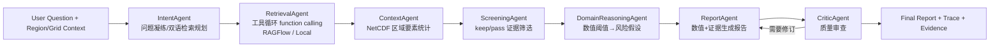

# Ocean Digital Earth RAG Multi-Agent Demo

面向求职展示的海洋数字地球项目：用 Cesium 展示可旋转三维地球，用 NetCDF 读取真实海洋要素并渲染填色图，用 RAGFlow/本地知识库 + DeepSeek + 多 Agent 生成海洋风险分析报告。

## 核心能力

- 三维数字地球：Cesium 大地球、框选区域、海洋要素叠加渲染。
- 二维定位辅助：OpenLayers 小地图同步框选和栅格结果。
- NetCDF 后端解析：Flask 读取 `.nc`，按经纬度 bbox 切片，支持 `step/max_points` 降采样。
- 知识库问答：本地文档回退 + 可选 RAGFlow 检索。
- 多 Agent 报告：Intent、Retrieval（工具循环 / function calling）、Context、Screening、DomainReasoning、Report、Critic 七个 Agent 组成可追踪流水线。
- 区域数值×RAG 融合：框选海域后 ContextAgent 调用 NetCDF 工具取要素统计，DomainReasoningAgent 按阈值触发风险假设，报告同时结合数值与文献证据。
- 离线评测：`eval/` 提供问题集与指标脚本（检索命中率 / 主题召回 / 引用覆盖 / 耗时 / 忠实度），无 Key 也能跑确定性指标。
- 工程化部署：Nginx + Flask/Gunicorn + GeoServer + SQLite + Docker Compose。
- 证据链展示：前端展示 RAGFlow/local 状态、Agent trace、keep/pass 文档、文档名、页码、知识库来源、Critic 结果。

## 访问地址

- Demo Web: http://127.0.0.1:8000
- Demo Health: http://127.0.0.1:8000/api/health
- Project Status: http://127.0.0.1:8000/api/project/status
- RAG Status: http://127.0.0.1:8000/api/rag/status
- GeoServer: http://127.0.0.1:8000/geoserver/web/
- RAGFlow Web: http://127.0.0.1:8088
- RAGFlow API: http://127.0.0.1:9380

## 快速启动

```powershell
cd C:\Users\lmh\Desktop\海洋rag+多agent

# Windows 中文路径下建议关闭 BuildKit，避免 Docker Compose gRPC session 编码问题
$env:DOCKER_BUILDKIT='0'
$env:COMPOSE_DOCKER_CLI_BUILD='1'

docker compose up -d --build
```

启动 RAGFlow：

```powershell
cd C:\Users\lmh\Desktop\海洋rag+多agent\ragflow_stack
docker compose up -d
```

诊断：

```powershell
cd C:\Users\lmh\Desktop\海洋rag+多agent
powershell -ExecutionPolicy Bypass -File scripts\diagnose.ps1

# 额外触发一次 arXiv 文献拉取等慢速检查
powershell -ExecutionPolicy Bypass -File scripts\diagnose.ps1 -Deep
```

## 环境变量

复制 `.env.example` 为 `.env`，填入自己的配置：

```text
DEEPSEEK_API_KEY=...
DEEPSEEK_MODEL=deepseek-chat
DEEPSEEK_BASE_URL=https://api.deepseek.com

RAGFLOW_BASE_URL=http://host.docker.internal:9380
RAGFLOW_API_KEY=...
RAGFLOW_DATASET_IDS=dataset_id_1,dataset_id_2
```

说明：

- DeepSeek 用于 Intent、Screening、Report、Critic。
- RAGFlow 未配置时，系统自动回退到 `data/ocean_knowledge.json`、`data/knowledge_docs/`、`data/pdf_reports/` 的本地检索。
- `.env` 已加入 `.gitignore`，不要提交真实 Key。

## 数据目录

```text
data/
  nc_uploads/        # 用户下载的 NetCDF 文件
  pdf_reports/       # 用户下载的 PDF 报告
  knowledge_docs/    # 本地摘要种子文档
  ocean_knowledge.json
  sample_ocean.nc
```

当前已识别 10 个 NetCDF 数据集，包括 SST、盐度、叶绿素、浪高、涌浪方向、涌浪周期等。页面点击“同步”或调用：

```powershell
Invoke-RestMethod http://127.0.0.1:8000/api/sync -Method Post
```

补充 arXiv 摘要文献到本地知识库：

```powershell
python -m geo_agent.knowledge.arxiv_fetcher --all --max 1 --queries-per-domain 1 --delay 0 --timeout 20
```

生成的 Markdown 会写入 `data/knowledge_docs/`，可直接用于本地检索，也可上传到 RAGFlow 建库。

## API 摘要

- `GET /api/project/status`：聚合项目状态，适合演示或面试排障。
- `GET /api/ocean/datasets`：返回可渲染 NetCDF 数据集、变量、分辨率和推荐步长。
- `POST /api/ocean/query`：按 bbox 读取 NetCDF 切片并返回 grid/stats。
- `GET /api/rag/status`：返回 LLM、本地知识库、RAGFlow 配置状态。
- `POST /api/agents/report`：运行多 Agent 报告流水线，入参可带 `region`(框选 bbox) 与 `variables`；返回 `trace`、`critic`、`ocean_context`、`risk_hypotheses`、`kept_documents`、`passed_documents`。
- `GET /api/agents`：返回各 Agent 能力清单。
- `GET /.well-known/agent-card.json`：A2A 风格 AgentCard（内嵌工具 schema）。

RAGFlow 检索会额外补全文档元数据：后端调用 `GET /api/v1/datasets` 和 `GET /api/v1/datasets/{dataset_id}/documents` 建立缓存，把 retrieval chunk 关联回文件名、知识库名、语言、页码和相似度分解，前端证据卡片可直接展示来源。

## 多 Agent 流程



## 面试讲法

这个项目不要只讲“接了大模型”。重点讲三条线：

1. 空间数据线：前端框选经纬度 bbox，后端对 NetCDF 做坐标索引、切片、降采样、统计，返回栅格，前端映射成填色图。
2. 知识检索线：RAGFlow 有配置则用向量检索，未配置则本地 BM25 风格回退，保证 demo 可用。
3. Agent 证据线：先凝练意图，再用工具循环让 LLM 自主决定检索 query（function calling），再筛证据，结合区域数值做风险推理，再生成报告，最后 Critic 审查并可打回重写；前端把 trace 和 keep/pass 展示出来，避免“黑盒问答”。
4. 工程可信度线：`tools.py` 工具注册 + ReAct 工具循环、各 Agent 无 Key 自动降级、`eval/` 离线评测给出量化指标。

## 评测

离线评测脚本对固定问题集跑完整流水线并输出指标。确定性指标（检索命中率 / 主题召回 / 引用覆盖 / 耗时 / Critic 修订）无需 API Key；配置 DeepSeek 后额外计算 LLM-as-judge 忠实度。

```powershell
python eval\run_eval.py --backend local
```

结果写入 `eval/report.md` 与 `eval/report.json`。当前本地基线（10 题）：检索命中率 0.9、主题召回 0.9、引用覆盖 0.9、平均端到端耗时约 7ms。

## 已知边界

- 本地 PDF 默认只用文件名和元数据参与检索，全文解析建议交给 RAGFlow。
- GeoServer 当前作为部署组件和后续 WMS/WCS 扩展入口，NetCDF 渲染主链路仍走 Flask。
- NetCDF 时间/深度维度目前默认取第 0 层，后续可以加时间轴和深度选择。
- 风速、云量、能见度、AOD 等变量如果未在当前 NetCDF 数据集中出现，报告会显式标记为数据缺口，不会据此下强结论。
- RAGFlow 需要手动在 Web 端建库、上传文档、解析完成后复制 API Key 和 Dataset ID 到 `.env`。
