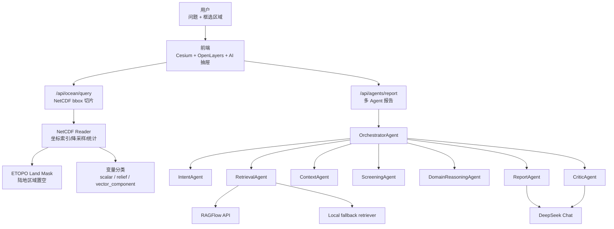

# 海洋 RAGFlow 多 Agent 报告生成框架设计

## 目标

本设计文档描述当前海洋数字地球项目的多 Agent 报告链路，以及它与 NetCDF 空间数据、RAGFlow 知识库、前端渲染规则之间的关系。

系统目标不是“把大模型接到地图上”，而是构建一条可解释的数据和证据链：

1. 用户在地球上框选区域。
2. 后端读取 NetCDF，得到区域统计、格点和变量类型。
3. 前端按变量类型限制渲染方式，避免错误表达。
4. 多 Agent 使用区域数值和 RAGFlow 文献证据生成报告。
5. CriticAgent 对报告进行质量审查，前端展示 trace 和证据链。

## 设计原则

- **证据优先**：报告结论必须来自区域数据、检索文献或明确的数据缺口说明。
- **物理一致**：标量变量不做粒子流，只有真实 `u/v` 矢量场才能开放 Windy 风格粒子。
- **可降级**：RAGFlow 不可用时回退本地知识库，LLM 不可用时保留确定性摘要和诊断信息。
- **可排障**：每一步输出 trace、状态、耗时、数据源和筛选结果。
- **先内部编排，后服务拆分**：短期在 Flask 内部编排，长期可拆为 A2A 兼容 Agent 服务。

## 总体架构



## 数据和渲染分类

后端在 `GET /api/ocean/datasets` 和 `POST /api/ocean/query` 中返回变量分类元数据。前端不再靠按钮硬切，而是根据元数据控制可用渲染方式。

| 分类 | 数据例子 | 返回字段 | 前端行为 |
| --- | --- | --- | --- |
| `scalar` | SST、SST anomaly、盐度、叶绿素、浪高 | `render_modes=["heatmap","contour","points"]` | 粒子按钮禁用 |
| `relief` | ETOPO elevation/bathymetry | `land_mask="positive"` | 正高程陆地不渲染 |
| `vector_component` | `u`、`v`、`uo`、`vo`、`u10`、`v10` | `vector_role`、`vector_pair` | 当前只识别，不开放粒子 |
| `vector` | 后续由 `u/v` 合成 | `particle_ready=true` | 开放 Windy 风格粒子 |

### 陆地掩膜

当前 land mask 使用 `data/nc_uploads/etopo2022_taiwan_30s_bathy.nc`。后端查询海洋变量时：

- 先读取目标变量格点。
- 再用 ETOPO 判断格点中心和格子覆盖范围是否碰到陆地。
- 碰到陆地的格点置为 `null`。
- 统计值在掩膜后重新计算。

这避免了 SST anomaly 等粗分辨率格子直接覆盖台湾、华南等陆地区域。

## Agent 职责

### 1. OrchestratorAgent

入口编排器，负责：

- 创建任务 ID。
- 汇总用户问题、前端框选区域、当前海洋变量、区域统计。
- 调用下游 Agent。
- 保存 trace，供前端展示。

输入示例：

```json
{
  "question": "目标海域海温异常对渔业有什么影响？",
  "region": {"west": 118, "east": 123, "south": 21, "north": 25},
  "ocean_grid": {
    "dataset": "sst_anomaly_oisst_taiwan_small",
    "variable": "anom",
    "stats": {"mean": 0.81, "max": 3.06}
  },
  "backend": "auto",
  "top_k": 8
}
```

### 2. IntentAgent

负责问题凝练和检索计划：

- 判断任务类型：风险评估、背景解释、规划建议、航行安全、生态影响等。
- 识别主题：海温、盐度、叶绿素、海浪、海洋热浪、酸化、海平面、近岸污染、生态保护、灾害。
- 生成中英双语检索 query。
- 判断是否需要区域数据、年份过滤、报告类型过滤。

输出示例：

```json
{
  "intent": "risk_assessment",
  "topics": ["海温异常", "渔业", "生态风险"],
  "queries": [
    "海温异常 渔业 生态风险 监测 规划",
    "sea surface temperature anomaly fishery ecological risk monitoring planning"
  ],
  "needs_region_context": true
}
```

### 3. RetrievalAgent

负责调用 RAGFlow 或本地 fallback：

- `backend=ragflow`：强制使用 RAGFlow。
- `backend=auto`：优先 RAGFlow，失败后回退本地 RAG。
- `backend=local`：只使用本地知识库。

RAGFlow 请求建议：

```json
{
  "question": "海温异常 渔业 生态风险 sea surface temperature anomaly fishery risk",
  "dataset_ids": ["ocean_cn_reports", "ocean_en_products"],
  "page": 1,
  "page_size": 12,
  "top_k": 24,
  "similarity_threshold": 0.15,
  "vector_similarity_weight": 0.75,
  "keyword": true,
  "cross_languages": ["Chinese", "English"],
  "toc_enhance": true
}
```

输出统一成：

```json
{
  "chunk_id": "...",
  "document_id": "...",
  "document_name": "2023年中国海洋生态环境状况公报.pdf",
  "content": "...",
  "score": 0.71,
  "source": "ragflow",
  "metadata": {"language": "zh", "year": 2023}
}
```

### 4. ContextAgent

负责把地球框选和 NC 查询结果转成报告上下文：

- 区域边界。
- 数据集、变量、单位、分类。
- 统计量：min/max/mean/count/step。
- 掩膜信息：`land_mask_applied`、数据有效范围。
- 局限性：时间层、深度层、分辨率、覆盖范围。

输出示例：

```json
{
  "region_summary": "框选区域约为台湾周边 117E-127E, 20N-26N。",
  "ocean_variables": [
    {
      "variable": "anom",
      "category": "scalar",
      "mean": 0.81,
      "units": "Celsius",
      "land_mask_applied": 37
    }
  ],
  "limitations": ["当前时间维度默认取第 0 层。", "粗分辨率数据不能解释小尺度近岸过程。"]
}
```

### 5. ScreeningAgent

负责相关性筛选：

- 对每个 chunk 输出 keep/pass。
- 给出相关性分数和理由。
- 区分直接证据、背景证据、无关证据。
- 防止只因标题相似而把弱相关文档带入报告。

输出示例：

```json
{
  "document_name": "2023年中国海洋生态环境状况公报.pdf",
  "decision": "keep",
  "score": 0.82,
  "evidence_type": "direct",
  "reason": "包含近岸海域生态监测、赤潮或生态风险相关信息。"
}
```

### 6. DomainReasoningAgent

负责把数值和证据转成风险假设：

- SST 或 SST anomaly 偏高：触发海洋热浪、珊瑚、渔业风险假设。
- chlor_a 偏高：提示富营养化、藻华和近岸污染监测。
- wave height 或 swell 异常：提示航行安全、近岸灾害、港口作业风险。
- salinity 异常：提示淡水输入、河口混合、海气过程不确定性。

它不直接编造结论，只输出“由当前数据和证据支持的风险假设”和“不确定性”。

### 7. ReportAgent

负责最终报告：

1. 问题凝练
2. 区域与数据背景
3. 检索与证据筛选说明
4. 核心发现
5. 风险评估
6. 监测指标建议
7. 空间规划/治理建议
8. 不确定性与下一步数据需求
9. 参考来源

### 8. CriticAgent

负责质量检查：

- 是否引用了证据。
- 是否把 metadata 当作正文证据。
- 是否存在“证据不足却强结论”的问题。
- 是否遗漏用户问题中的核心要素。
- 是否说明数据局限。
- 是否输出可执行建议。

若检查失败，返回修改意见给 ReportAgent 重写。

## Trace 设计

每次报告生成保存 trace：

```json
{
  "task_id": "...",
  "intent": {...},
  "context": {
    "variables": ["anom"],
    "land_mask_applied": 37
  },
  "retrieval": {
    "backend": "ragflow",
    "queries": ["..."],
    "candidate_count": 24
  },
  "screening": [
    {"document": "...", "decision": "keep", "score": 0.82},
    {"document": "...", "decision": "pass", "score": 0.18}
  ],
  "report": {
    "model": "deepseek-chat",
    "elapsed_ms": 18320
  }
}
```

前端可以把 trace 做成“证据链抽屉”，用户点击报告中的来源即可查看对应片段。

## API 设计

### 生成报告

`POST /api/agents/report`

```json
{
  "question": "...",
  "backend": "auto",
  "top_k": 8,
  "region": {"west": 118, "east": 123, "south": 21, "north": 25},
  "ocean_grid": {...},
  "trace": true
}
```

### 查询任务

`GET /api/agents/tasks/{task_id}`

### Agent 能力清单

`GET /api/agents`

### A2A 兼容 Agent Card

`GET /.well-known/agent-card.json`

```json
{
  "name": "OceanReportAgent",
  "description": "Generate evidence-grounded ocean risk and planning reports using RAGFlow and ocean gridded data.",
  "version": "0.1.0",
  "url": "http://127.0.0.1:8000/api/a2a",
  "skills": [
    {"name": "ocean_report", "description": "Generate ocean knowledge reports with citations."},
    {"name": "ocean_risk_assessment", "description": "Assess regional marine risks from RAG and NetCDF data."}
  ],
  "defaultInputModes": ["text", "application/json"],
  "defaultOutputModes": ["text/markdown", "application/json"]
}
```

## 当前已完成

- 多 Agent 报告流水线已具备可演示版本。
- RAGFlow/local fallback 检索链路已接入。
- 前端展示 trace、证据、报告阅读面板。
- NetCDF 数据集发现、bbox 查询、统计和渲染已接入。
- 变量分类元数据已接入前后端。
- 陆地掩膜已接入查询结果。
- GitHub 远程仓库已配置并推送。

## 下一阶段实施路线

### 阶段 1：真实矢量场接入

- 下载小范围 `u/v` 风场或海流 NetCDF。
- 优先候选：`u10/v10` 风场或 `uo/vo` 表层海流。
- 后端新增矢量场联合查询：
  - 输入：dataset、u variable、v variable、bbox。
  - 输出：`u_values`、`v_values`、`speed_values`、stats、单位、时间层。
- 前端只对 `particle_ready=true` 的矢量场开放粒子流。

### 阶段 2：渲染质量

- 标量填色：保留稳定的 fill/contour/point 三类，不追求假动画。
- 水深地形：使用专用海底色带，陆地透明。
- 矢量粒子：按真实 `u/v` 插值移动，支持粒子数量、速度倍率、拖尾长度。
- 小地图：保持静态缩略图，避免动画重建图层导致闪烁。

### 阶段 3：报告可信度

- 在报告中显式引用当前变量分类和数据局限。
- 若用户要求粒子但当前数据不是矢量场，报告中说明“缺少真实 u/v 数据”。
- 增加每个核心结论的证据绑定。

### 阶段 4：服务化和 A2A

- 暴露 Agent Card。
- 引入 task/message/artifact 数据结构。
- 支持异步任务和轮询。
- 后续可把 RetrievalAgent、ReportAgent 拆成独立容器。

## 风险和边界

- RAGFlow 需要手工建库、上传文档、解析并配置 Dataset ID。
- 当前 NetCDF 时间/深度维度默认取第 0 层。
- Docker 在中文路径下 build 可能触发 gRPC header 编码问题，推荐英文路径 clone 后构建。
- 粒子流必须等真实矢量场数据，不能再用 SST 或 ETOPO 伪造。
- ETOPO 掩膜只覆盖已下载区域，超出覆盖范围的数据不会被掩膜。
